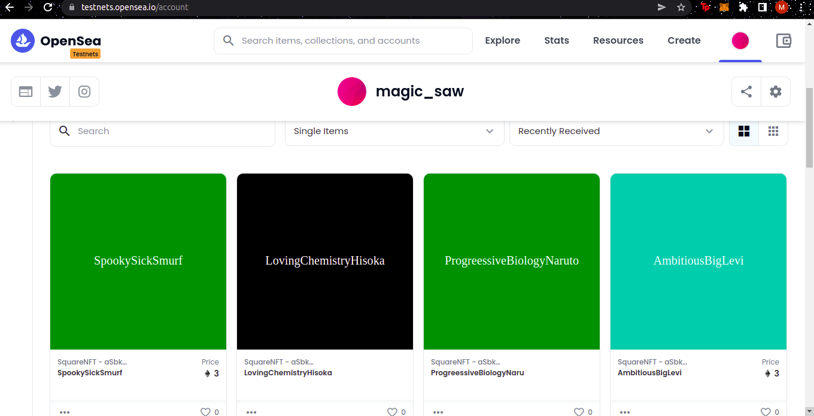
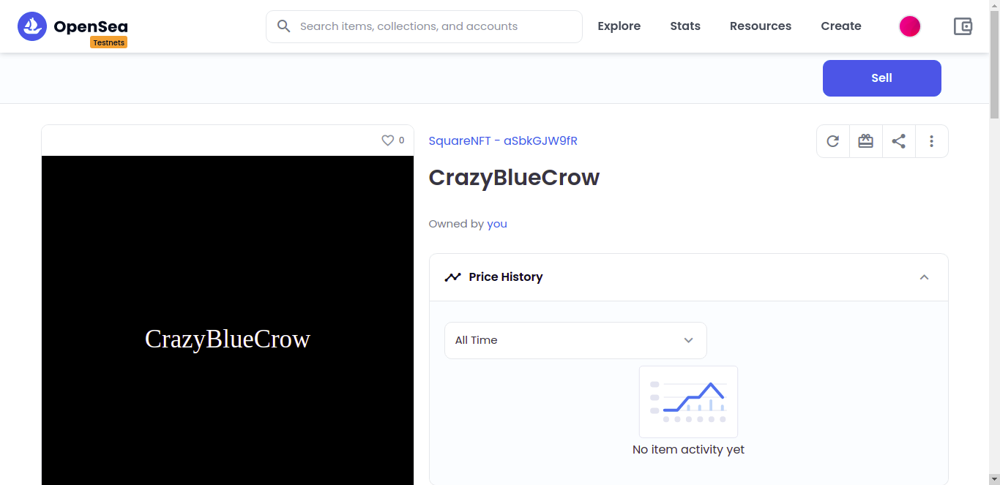

# Smart Contract
This smart contract is deployed into the <b>blockchain</b>. This way, anyone in the world will be able to access and run our smart contract — and we'll let them mint NFTs!
A smart contract is a piece of code that lives on the blockchain. The blockchain is a public place where anyone can securely read and write data for a fee.

This project demonstrates a basic Hardhat use case. It comes with a sample contract, a test for that contract, a sample script that deploys that contract, and an example of a task implementation, which simply lists the available accounts.

Try running some of the following tasks:

```shell
npx hardhat accounts
npx hardhat compile
npx hardhat clean
npx hardhat test
npx hardhat node
node scripts/sample-script.js
npx hardhat help
```
## NFT collection on Opensea


